# 🧠 DSA Solver AI

> **An intelligent Data Structures & Algorithms problem-solving assistant powered by AutoGen and AI**

[](https://python.org)
[](https://github.com/microsoft/autogen)
[](https://streamlit.io)
[](https://docker.com)
[](LICENSE)

## 🚀 Overview

DSA Solver AI is an intelligent assistant that helps solve Data Structures and Algorithms problems using a multi-agent system. It combines the power of AI language models with secure code execution in Docker containers to provide comprehensive solutions with explanations, code implementation, and test cases.

### ✨ Key Features

- 🤖 **Multi-Agent System**: Collaborative problem-solving with specialized agents
- 🐳 **Secure Code Execution**: Isolated Docker environment for safe code testing
- 🌐 **Multiple Interfaces**: Both web UI (Streamlit) and CLI support
- 🧪 **Automated Testing**: Generates and runs test cases for solutions
- 📊 **Multiple AI Models**: Support for various AI models via Euri AI
- 🔄 **Real-time Streaming**: Live updates during problem-solving process

## 🏗️ Architecture

```mermaid
graph TB
    subgraph "User Interface Layer"
        UI1[🌐 Streamlit Web App<br/>app.py]
        UI2[💻 CLI Interface<br/>main.py]
    end
    
    subgraph "Agent Layer"
        PSA[🧠 Problem Solver Expert<br/>problem_solver_agent.py]
        CEA[⚙️ Code Executor Agent<br/>code_executor_agent.py]
    end
    
    subgraph "Team Orchestration"
        TEAM[🤝 DSA Solver Team<br/>dsa_solver_team.py]
        TERM[🛑 Termination Condition<br/>TextMentionTermination]
    end
    
    subgraph "Model & Configuration"
        MC[🤖 Model Client<br/>QuietEuriChatCompletionClient]
        CONF[⚙️ Configuration<br/>constants.py]
    end
    
    subgraph "Code Execution Environment"
        DOCKER[🐳 Docker Container<br/>DockerCommandLineCodeExecutor]
        WORKSPACE[📁 Workspace<br/>tmp/]
    end
    
    subgraph "External Services"
        EURI[🌐 Euri AI API<br/>Multiple Models Available]
        DOCKER_ENGINE[🐳 Docker Engine]
    end
```



### 🔧 System Components

#### **Agent Layer**
- **Problem Solver Expert**: Analyzes DSA problems and generates solutions
- **Code Executor Agent**: Executes code safely in Docker containers

#### **Team Orchestration**
- **DSA Solver Team**: Coordinates agent collaboration using RoundRobinGroupChat
- **Termination Condition**: Automatically stops when solution is complete

#### **Model & Configuration**
- **Model Client**: Interfaces with multiple AI models (GPT-4o, Gemini, Claude, etc.)
- **Configuration**: Centralized settings for timeouts, models, and parameters

#### **Execution Environment**
- **Docker Integration**: Secure, isolated code execution
- **Workspace Management**: Temporary file handling and cleanup

## 🛠️ Installation

### Prerequisites

- Python 3.8 or higher
- Docker Desktop installed and running
- Git

### Quick Start

1. **Clone the repository**
   ```bash
   git clone https://github.com/yourusername/dsa-solver-ai.git
   cd dsa-solver-ai
   ```

2. **Create virtual environment**
   ```bash
   python -m venv autogen_env
   source autogen_env/bin/activate  # On Windows: autogen_env\Scripts\activate
   ```

3. **Install dependencies**
   ```bash
   pip install -r requirements.txt
   ```

4. **Set up environment variables**
   ```bash
   # Create .env file
   echo "EURI_API_KEY=your_euri_api_key_here" > .env
   ```

5. **Start Docker** (ensure Docker Desktop is running)

6. **Run the application**
   
   **Web Interface:**
   ```bash
   streamlit run app.py
   ```
   
   **CLI Interface:**
   ```bash
   python main.py
   ```

## 🎯 Usage

### Web Interface (Recommended)

1. Open your browser to `http://localhost:8501`
2. Enter your DSA problem in the text area
3. Click "Solve DSA Problem"
4. Watch as the AI agents collaborate to solve your problem
5. Review the solution, explanation, and test results

### CLI Interface

```bash
python main.py
```

The CLI will automatically solve the predefined problem. To change the problem, edit the `task` variable in `main.py`.

### Example Problems

- "Write a Python function to find the longest common subsequence"
- "Implement a binary search tree with insert, delete, and search operations"
- "Create a solution for the two-sum problem with O(n) time complexity"
- "Design an algorithm to detect cycles in a linked list"

## 📁 Project Structure

```
DSA Solver/
├── 📱 app.py                    # Streamlit web interface
├── 🖥️ main.py                   # CLI interface
├── 📋 requirements.txt          # Python dependencies
├── 📖 README.md                 # This file
├── 🤖 agents/
│   ├── problem_solver_agent.py  # AI problem solver
│   └── code_executor_agent.py   # Code execution agent
├── ⚙️ config/
│   ├── constants.py             # Configuration constants
│   ├── docker_utils.py          # Docker management utilities
│   └── model_client.py          # AI model client configuration
├── 👥 team/
│   └── dsa_solver_team.py       # Agent team orchestration
├── 🔧 tools/                    # Additional tools (extensible)
├── 🛠️ utils/                    # Utility functions
└── 📁 tmp/                      # Temporary workspace for code execution
```

## ⚙️ Configuration

### Model Configuration

The system supports multiple AI models through the Euri AI platform:

- **GPT-4o**: OpenAI's flagship model
- **Claude Sonnet 4**: Anthropic's reasoning model
- **Gemini 2.5 Pro**: Google's multimodal model
- **Llama 4**: Meta's open-source model
- **DeepSeek R1**: Specialized for math/code tasks

Configure your preferred model in `config/model_client.py`.

### Docker Configuration

Adjust Docker settings in `config/constants.py`:

```python
DOCKER_WORK_DIR = 'tmp'      # Working directory
DOCKER_TIMEOUT = 120         # Execution timeout (seconds)
```

## 🧪 Testing

The system automatically generates and runs test cases for each solution. Test cases include:

- **Edge cases**: Empty inputs, boundary conditions
- **Normal cases**: Typical problem scenarios
- **Stress tests**: Large inputs, performance validation

## 🔍 How It Works

### Problem-Solving Workflow

1. **Problem Analysis**: The Problem Solver Expert analyzes the input problem
2. **Solution Design**: Generates an algorithmic approach and explanation
3. **Code Generation**: Creates Python code with proper formatting and test cases
4. **Code Execution**: The Code Executor Agent runs the code in a secure Docker container
5. **Result Validation**: Verifies output and handles any errors
6. **Iteration**: If errors occur, the system automatically fixes and retries
7. **Final Report**: Provides comprehensive solution with explanations

### Agent Collaboration


## 🎨 Features in Detail

### 🌐 Streamlit Web Interface

- **Modern UI**: Clean, professional design with custom CSS
- **Real-time Updates**: Live streaming of agent conversations
- **Interactive Chat**: Chat-like interface for better user experience
- **Status Indicators**: Visual feedback during processing
- **Error Handling**: Graceful error display and recovery

### 💻 CLI Interface

- **Simple Execution**: Direct command-line problem solving
- **Detailed Output**: Comprehensive logging and results
- **Batch Processing**: Suitable for automated workflows
- **Debug Mode**: Enhanced error reporting for development

### 🤖 AI Model Support

| Model | Provider | Strengths | Use Case |
|-------|----------|-----------|----------|
| GPT-4o | OpenAI | General reasoning, code generation | Complex algorithms |
| Claude Sonnet 4 | Anthropic | Logic, analysis | Mathematical problems |
| Gemini 2.5 Pro | Google | Multimodal, fast | Visual problems |
| Llama 4 Scout | Meta | Factual accuracy | Research-heavy tasks |
| DeepSeek R1 | DeepSeek | Math/code specialization | Technical problems |

## 🚨 Troubleshooting

### Common Issues

**Docker not starting:**
```bash
# Check Docker status
docker --version
docker ps

# Restart Docker Desktop
# On Windows: Restart Docker Desktop application
# On Linux: sudo systemctl restart docker
```

**Import errors:**
```bash
# Reinstall dependencies
pip install --upgrade -r requirements.txt

# Check Python version
python --version  # Should be 3.8+
```

**API key issues:**
```bash
# Verify environment variables
echo $EURI_API_KEY  # Should show your API key

# Check .env file
cat .env
```

**Memory issues:**
```bash
# Increase Docker memory limit in Docker Desktop settings
# Recommended: 4GB+ RAM allocation
```

## 🔧 Advanced Configuration

### Custom Model Configuration

```python
# config/model_client.py
def create_custom_client():
    return QuietEuriChatCompletionClient(
        model="your-preferred-model",
        temperature=0.1,
        max_tokens=2000
    )
```

### Docker Customization

```python
# config/docker_utils.py
docker_executor = DockerCommandLineCodeExecutor(
    work_dir="custom_workspace",
    timeout=300,  # 5 minutes
    image="python:3.11-slim"  # Custom Python image
)
```

### Agent Behavior Tuning

Modify agent system messages in `agents/problem_solver_agent.py` to customize:
- Problem-solving approach
- Code style preferences
- Test case generation
- Explanation detail level

## 📊 Performance & Limitations

### Performance Metrics

- **Average Response Time**: 30-60 seconds for complex problems
- **Success Rate**: 95%+ for standard DSA problems
- **Supported Languages**: Python (primary), with extensibility for others
- **Concurrent Users**: Supports multiple simultaneous sessions

### Current Limitations

- **Language Support**: Currently optimized for Python
- **Problem Complexity**: Best suited for standard DSA problems
- **Resource Usage**: Requires Docker and sufficient RAM (4GB+ recommended)
- **API Dependencies**: Requires active internet connection for AI models

### Roadmap

- [ ] Multi-language support (Java, C++, JavaScript)
- [ ] Advanced visualization for algorithms
- [ ] Performance benchmarking and optimization
- [ ] Integration with coding platforms (LeetCode, HackerRank)
- [ ] Offline mode with local models
- [ ] Team collaboration features

## 🔐 Security & Privacy

### Security Measures

- **Isolated Execution**: All code runs in secure Docker containers
- **No Data Persistence**: Temporary files are automatically cleaned up
- **API Security**: Secure communication with AI model providers
- **Input Validation**: Comprehensive input sanitization

### Privacy Policy

- **No Code Storage**: Your code is not permanently stored
- **Anonymous Usage**: No personal data collection
- **Local Processing**: Most operations happen locally
- **API Compliance**: Follows AI provider privacy policies

## 🤝 Contributing

We welcome contributions! Please see our [Contributing Guidelines](CONTRIBUTING.md) for details.

### Development Setup

1. Fork the repository
2. Create a feature branch: `git checkout -b feature-name`
3. Make your changes and add tests
4. Commit your changes: `git commit -am 'Add feature'`
5. Push to the branch: `git push origin feature-name`
6. Submit a pull request

### Contribution Areas

- 🐛 **Bug Fixes**: Report and fix issues
- ✨ **New Features**: Add new capabilities
- 📚 **Documentation**: Improve guides and examples
- 🧪 **Testing**: Add test cases and improve coverage
- 🎨 **UI/UX**: Enhance user interface and experience
- 🔧 **Performance**: Optimize speed and resource usage

## 📈 Analytics & Monitoring

### Usage Metrics

The system tracks anonymous usage metrics to improve performance:

- Problem types and complexity
- Solution success rates
- Performance bottlenecks
- Error patterns

### Health Monitoring

- **Docker Health**: Container status and resource usage
- **API Health**: Model availability and response times
- **System Health**: Memory, CPU, and disk usage
- **Error Tracking**: Automatic error logging and reporting

## 📄 License

This project is licensed under the MIT License - see the [LICENSE](LICENSE) file for details.

## 🙏 Acknowledgments

- [Microsoft AutoGen](https://github.com/microsoft/autogen) - Multi-agent framework
- [Euri AI](https://euri.ai) - AI model platform
- [Streamlit](https://streamlit.io) - Web interface framework
- [Docker](https://docker.com) - Containerization platform

## 📞 Support

- 📧 Email: support@example.com
- 💬 Discord: [Join our community](https://discord.gg/example)
- 🐛 Issues: [GitHub Issues](https://github.com/yourusername/dsa-solver-ai/issues)

---

<div align="center">
  <strong>Built with ❤️ for the coding community</strong>
</div>
